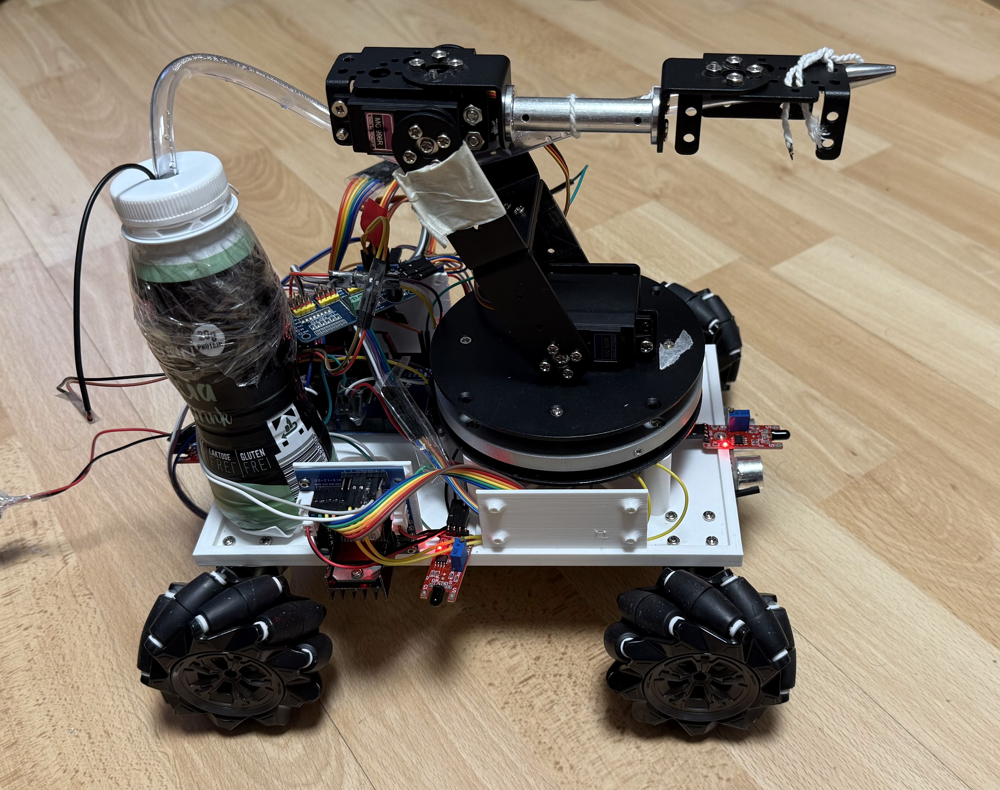

# Fire Extinguisher Robot

A fire-fighting robot capable of detecting flames in four directions and extinguishing fires using a water nozzle.

## Features
- **Flame Detection:** Uses multiple flame sensors for fire detection.
- **Omnidirectional Movement:** Equipped with Mecanum wheels for precise navigation.
- **Water Spraying System:** Controlled water nozzle to extinguish flames.
- **Autonomous & Manual Modes:** Operates autonomously but allows manual override using IR remote.
- **Obstacle Avoidance:** Ultrasonic sensors ensure safe operation.

## Hardware Used
- **Microcontroller:** Arduino Mega
- **Sensors:** Flame sensors, Ultrasonic sensor, IR remote receiver
- **Motors:** Mecanum wheels for movement
- **Power Supply:** LiPo battery
- **Other Components:** Water pump, relay module

## Software
- **Programming Language:** C (Arduino)
- **IDE:** Arduino IDE

## How to Use
1. Upload the Arduino code to the Mega board.
2. Ensure the robot has power and is connected properly.
3. Run in autonomous mode or control it manually via IR remote.

## Images

